<p align="center">
  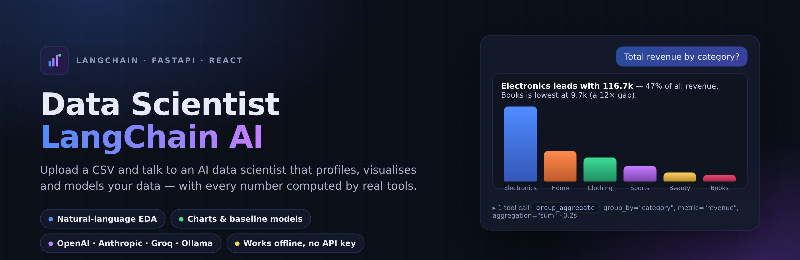
</p>

<h1 align="center">Data Scientist LangChain AI</h1>

<p align="center">
  <b>Upload a CSV, ask questions in plain English, get charts, statistics and baseline models back.</b><br>
  A LangChain tool-calling agent with a FastAPI backend and a React frontend — every number is computed by real pandas / scikit-learn tools, never invented by the LLM.
</p>

<p align="center">
  
  
  
  
  
  
</p>

---

## ✨ What it does

| | |
|---|---|
| 💬 **Chat with your data** | Ask *"average revenue by region"*, *"what drives satisfaction_score?"*, *"monthly trend of revenue"* — the agent picks the right analysis tool and answers with tables, charts and a short insight. |
| 📊 **Real charts** | Histograms, bar charts, scatter plots with trend lines, box plots, time-series, correlation heatmaps, feature-importance and confusion-matrix charts rendered with matplotlib. |
| 🤖 **Baseline models in one sentence** | *"Predict revenue"* trains a leakage-aware random forest on a hold-out split, compares it with a naive baseline and shows permutation importance. |
| 🔍 **Transparent** | Every answer shows the **tool calls** that produced it (inputs, raw output, timing). Nothing is hidden. |
| 🔌 **Any LLM provider** | OpenAI, Anthropic, Groq or a local Ollama model — switch with one environment variable. |
| 🔒 **Works without an API key** | No key? A deterministic *heuristic planner* routes your question to the same tools. Same numbers, no LLM cost. Great for demos, CI and privacy-sensitive data. |
| 📝 **Export** | Download the whole conversation — findings and charts — as a Markdown report. |

---

## 📸 Screenshots

**The workspace** — dataset profile on the left, suggested questions and a data preview in the middle. The badge in the top-right tells you which brain is active (LLM provider or the offline analyst).

<p align="center">
  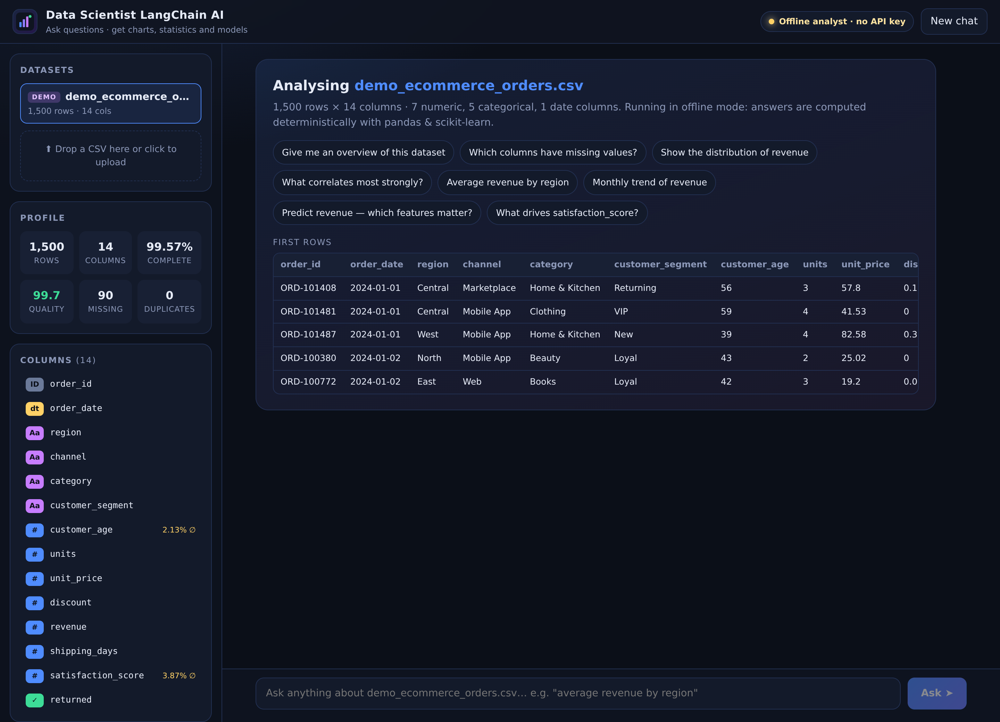
</p>

**Ask a question, get evidence** — a table, a one-line key takeaway and a chart, all computed from the data.

<p align="center">
  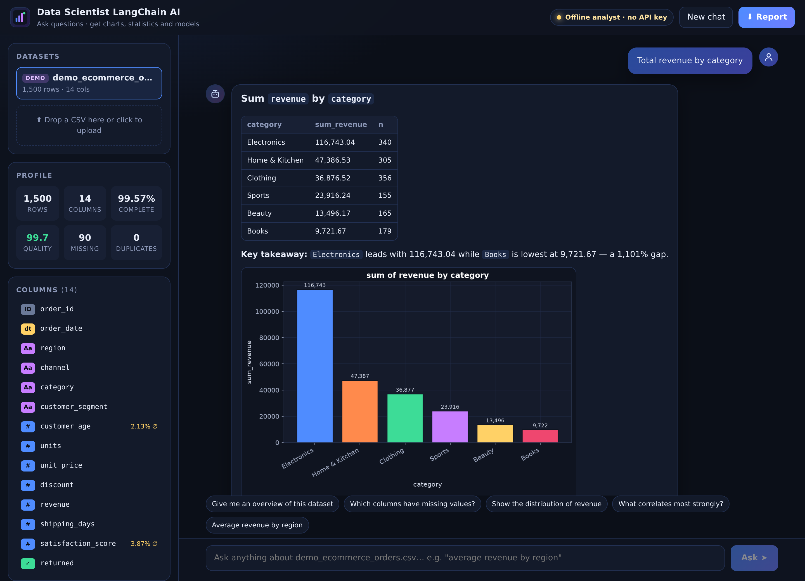
</p>

**Train a baseline model and inspect the trace** — metrics vs. a naive baseline, feature importance, actual-vs-predicted, and the expanded tool trace showing exactly what the agent ran.

<p align="center">
  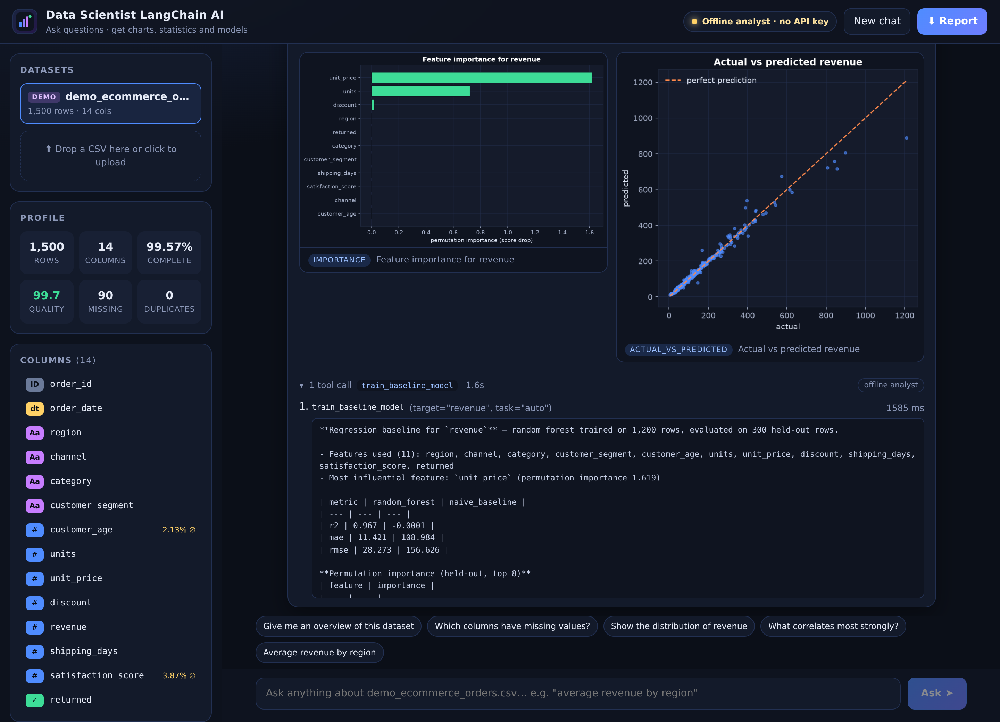
</p>

<table align="center">
  <tr>
    <td align="center" width="34%">
      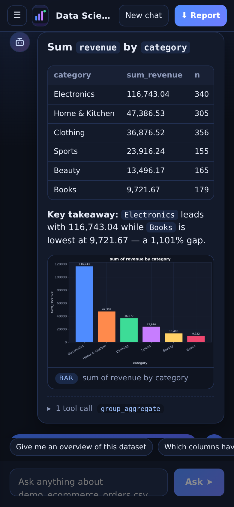<br>
      <sub><b>Responsive</b> — works on a phone too</sub>
    </td>
    <td align="center" width="66%">
      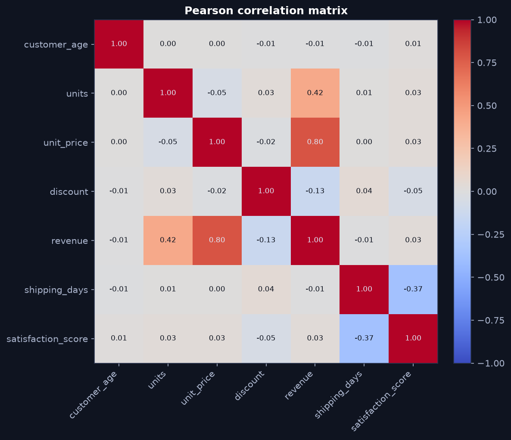<br>
      <sub><b>Correlation heatmap</b> — one of the charts the agent produces</sub>
    </td>
  </tr>
</table>

---

## 🏗️ Architecture

<p align="center">
  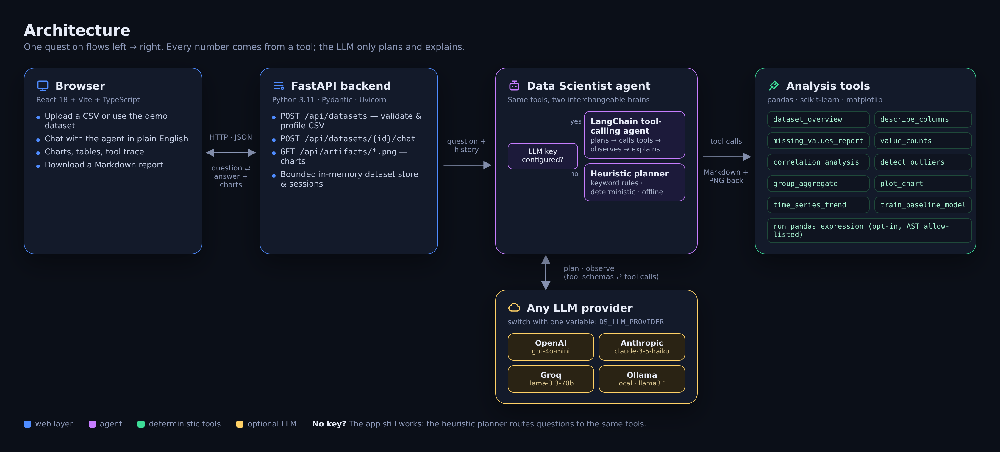
</p>

* **Browser (React + Vite + TypeScript)** — upload / pick a dataset, chat, view charts and traces. Talks only to relative `/api/...` URLs.
* **FastAPI backend** — validates and profiles CSVs, keeps a bounded in-memory dataset store, exposes the chat endpoint and serves chart PNGs plus the built frontend.
* **Data Scientist agent** — two interchangeable "brains" that share the same tools:
  * `LangChainBrain` — a LangChain **tool-calling agent** (`create_tool_calling_agent` + `AgentExecutor`). The LLM plans which tools to call, observes their output and writes the final insight.
  * `HeuristicBrain` — a **deterministic keyword planner** used when no LLM is configured (or as a fallback if the provider errors). It maps questions to the same tools with rules.
* **Analysis tools** — pure pandas / scikit-learn / matplotlib functions. This is the only place numbers come from.
* **LLM providers** — one factory (`backend/app/llm.py`) returns the right LangChain chat model for OpenAI, Anthropic, Groq or Ollama.

### How one question flows through the system

<p align="center">
  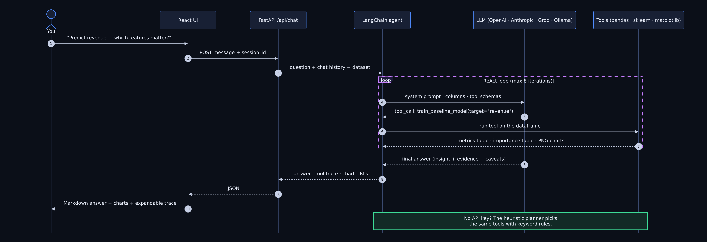
</p>

---

## 🚀 Quick start

Requires **Python 3.11+** and **Node.js 22+**.

```bash
git clone https://github.com/Sal1243/Data-scientist-langChain-AI.git
cd Data-scientist-langChain-AI

# 1) Backend dependencies
python3 -m venv .venv && source .venv/bin/activate
pip install -r requirements-dev.txt

# 2) Frontend build
cd frontend && npm install && npm run build && cd ..

# 3) Run
python -m uvicorn backend.app.main:app --host 0.0.0.0 --port 8000
```

Open **http://localhost:8000**. The synthetic demo dataset (1,500 e-commerce orders) is loaded automatically — click a suggested question or type your own. No API key is needed to try it.

Shortcuts: `make install && make start` does the same. `make dev` starts hot-reloading servers (FastAPI on :8000, Vite on :5173).

### Docker

```bash
docker build -t data-scientist-langchain-ai .
docker run --rm -p 8000:8000 --env-file .env data-scientist-langchain-ai
```

---

## 🔌 Choose your LLM

Copy `.env.example` to `.env` and set **one** provider. `auto` (the default) picks the first key it finds and otherwise falls back to the offline analyst.

| `DS_LLM_PROVIDER` | Credential / setting | Default model (`DS_LLM_MODEL`) |
|---|---|---|
| `openai` | `OPENAI_API_KEY` | `gpt-4o-mini` |
| `anthropic` | `ANTHROPIC_API_KEY` | `claude-3-5-haiku-latest` |
| `groq` | `GROQ_API_KEY` | `llama-3.3-70b-versatile` |
| `ollama` | `OLLAMA_BASE_URL` (default `http://localhost:11434`) | `llama3.1` |
| `heuristic` | — | no LLM; deterministic planner |
| `auto` | whichever key exists → `openai` → `anthropic` → `groq` → `heuristic` | per provider |

```bash
# example: OpenAI
echo "OPENAI_API_KEY=sk-..." >> .env
echo "DS_LLM_PROVIDER=openai" >> .env

# example: fully local with Ollama
ollama pull llama3.1
echo "DS_LLM_PROVIDER=ollama" >> .env
```

The **Offline analyst · no API key** / **LLM · provider / model** badge in the top bar always shows which brain answered, and every answer's trace carries the same label.

Other useful settings (see `.env.example`): `DS_MAX_ITERATIONS` (tool calls per question), `DS_ENABLE_CODE_TOOL` (opt-in restricted pandas expressions), `DS_MAX_UPLOAD_MB`, `DS_MAX_ROWS`, `DS_MAX_COLUMNS`, `DS_MAX_DATASETS`, `DS_ARTIFACT_DIR`, `DS_CORS_ORIGINS`.

---

## 💡 Things you can ask

| You say | The agent runs | You get |
|---|---|---|
| *Give me an overview of this dataset* | `dataset_overview` | shape, types, completeness, duplicates, quality score, preview |
| *Which columns have missing values?* | `missing_values_report` | missing table + handling advice |
| *Describe customer_age and units* | `describe_columns` | mean / std / quartiles / skew or unique / top |
| *Show the distribution of revenue* | `plot_chart(histogram)` | histogram with mean & median lines, skew summary |
| *Average revenue by region* · *Total revenue by category* | `group_aggregate` | ranked table, bar chart, "key takeaway" |
| *Most common channel* | `value_counts` | frequency table + share %, bar chart |
| *What correlates most strongly?* | `correlation_analysis` | strongest pairs, heatmap, plain-English reading |
| *revenue vs unit_price by category* | `plot_chart(scatter)` | scatter with trend line and Pearson r |
| *Monthly trend of revenue* | `time_series_trend` | first-half vs second-half change, peak/trough, line chart |
| *Are there outliers?* | `detect_outliers` | 1.5×IQR counts per column, box plot |
| *Predict revenue — which features matter?* · *Classify returned* | `train_baseline_model` | metrics vs naive baseline, permutation importance, actual-vs-predicted or confusion matrix |

With an LLM configured the agent can also chain tools ("compare regions, then tell me which one to investigate") and answer follow-ups using the conversation history.

---

## 📈 Charts the agent produces

<table>
  <tr>
    <td>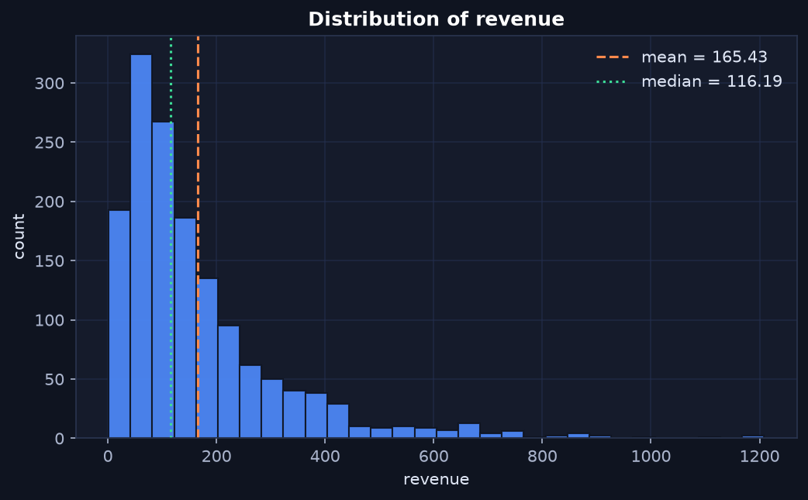</td>
    <td>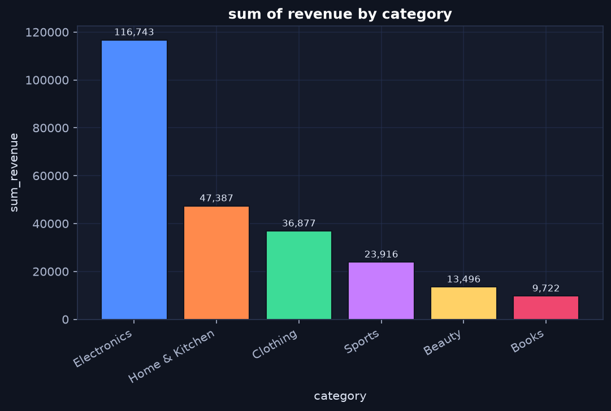</td>
  </tr>
  <tr>
    <td align="center"><sub>Distribution (histogram with mean / median)</sub></td>
    <td align="center"><sub>Group aggregate (bar chart with value labels)</sub></td>
  </tr>
  <tr>
    <td>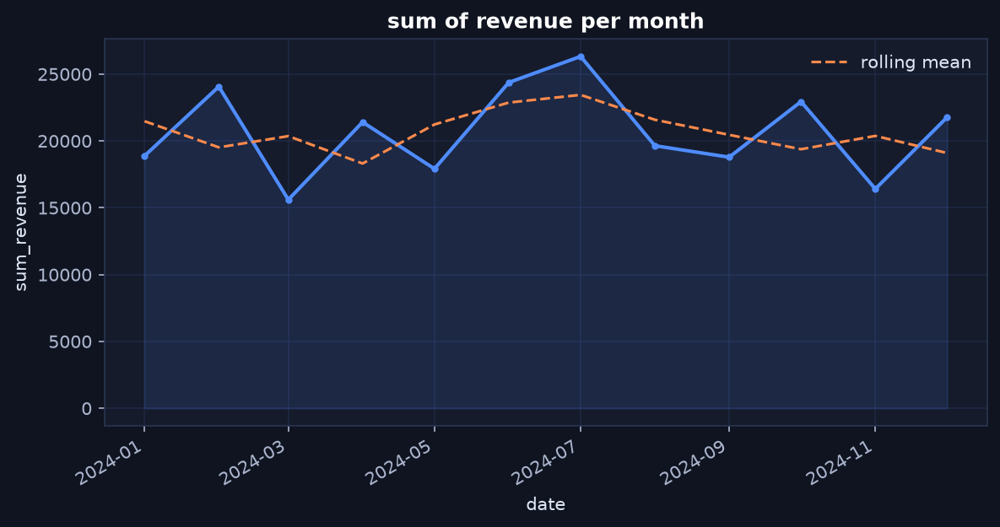</td>
    <td>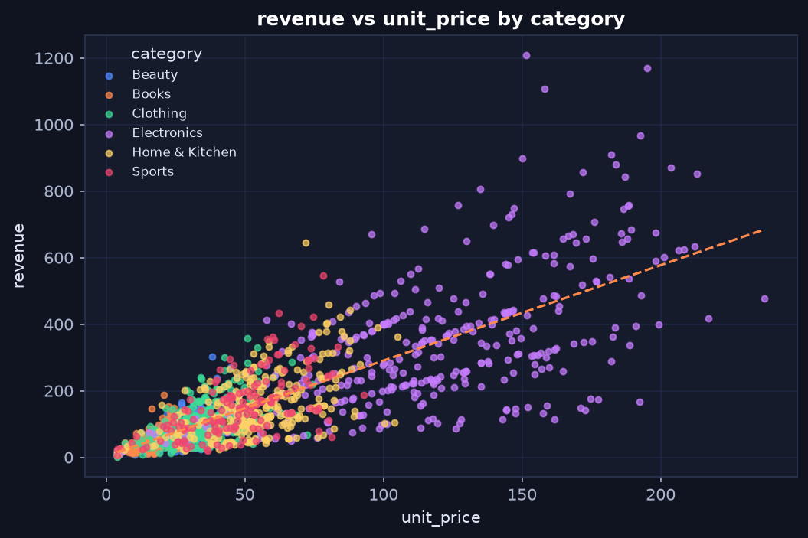</td>
  </tr>
  <tr>
    <td align="center"><sub>Time-series trend with rolling mean</sub></td>
    <td align="center"><sub>Scatter with trend line, coloured by category</sub></td>
  </tr>
  <tr>
    <td>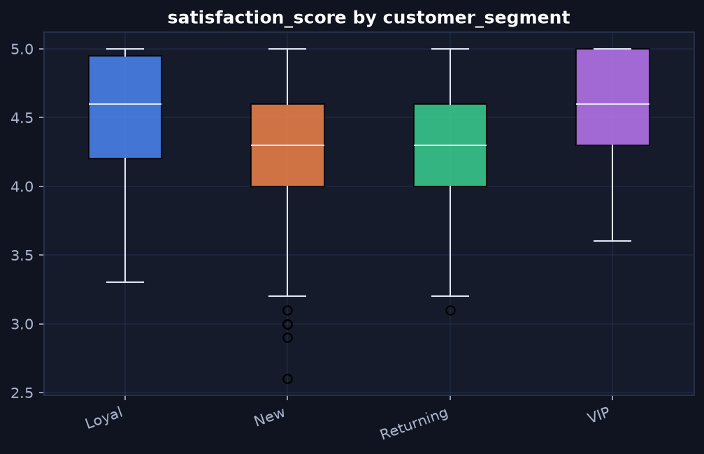</td>
    <td>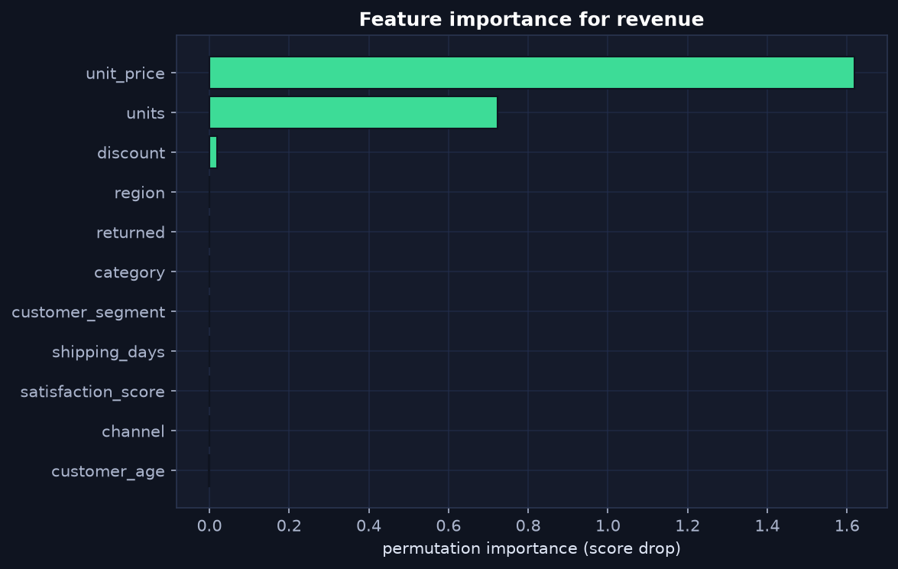</td>
  </tr>
  <tr>
    <td align="center"><sub>Box plot by group</sub></td>
    <td align="center"><sub>Permutation feature importance (held-out)</sub></td>
  </tr>
  <tr>
    <td>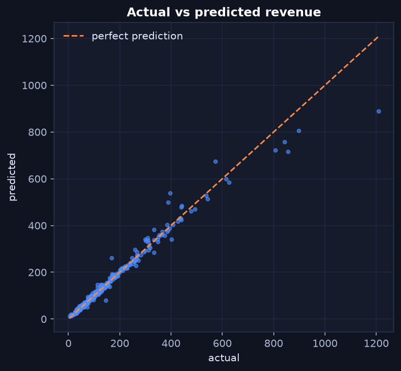</td>
    <td>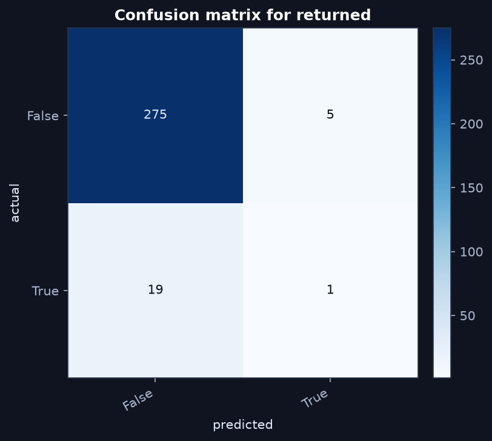</td>
  </tr>
  <tr>
    <td align="center"><sub>Regression: actual vs predicted</sub></td>
    <td align="center"><sub>Classification: confusion matrix</sub></td>
  </tr>
</table>

---

## 🧰 The agent's tools

All tools live in `backend/app/tools.py` and are plain LangChain `@tool` functions bound to the active dataframe. They return Markdown (for the LLM and the UI) and register any chart they draw.

| Tool | Purpose |
|---|---|
| `dataset_overview()` | rows, columns, dtypes, missing %, completeness, duplicates, quality score, first rows |
| `describe_columns(columns="")` | summary statistics per column (numeric, categorical, datetime aware) |
| `missing_values_report()` | missing counts / % with handling recommendations |
| `value_counts(column, top_n=10)` | frequency table + bar chart |
| `correlation_analysis(method="pearson", top_n=10)` | correlation matrix (pearson / spearman / kendall), strongest pairs, heatmap |
| `detect_outliers(columns="")` | 1.5×IQR outlier counts and bounds, box plot of the worst column |
| `group_aggregate(group_by, metric, aggregation="mean")` | mean / sum / count / median / min / max per category + bar chart |
| `plot_chart(kind, x, y="", hue="")` | histogram · scatter · box · bar · line |
| `time_series_trend(date_column, metric, aggregation="sum", freq="auto")` | day / week / month / year buckets, growth, peak & trough, line chart |
| `train_baseline_model(target, task="auto", features="")` | random-forest regression / classification with hold-out metrics vs naive baseline and permutation importance |
| `run_pandas_expression(expression)` | **opt-in** (`DS_ENABLE_CODE_TOOL=true`): one AST-allow-listed pandas expression on `df` — no imports, no I/O, no dunder access |

**Modelling contract:** exact duplicate rows are removed before splitting; the target and exact copies of it are excluded; identifiers, free text and dates are skipped; preprocessing (imputation, scaling, one-hot) is fitted on the training split only; 80/20 split (stratified for classification); seed 42; permutation importance is computed on the held-out split. A good hold-out score does **not** prove causality or future performance — the agent says so in every model answer.

---

## 🔗 API

Interactive docs: `http://localhost:8000/api/docs`

| Method & path | Purpose |
|---|---|
| `GET /api/health` | status, version and the active LLM mode / provider / model |
| `GET /api/datasets` | list datasets in the workspace (demo + uploads) |
| `POST /api/datasets` | upload a CSV (`multipart/form-data`, field `file`) → profile |
| `GET /api/datasets/{id}` | profile, column kinds, preview, suggested questions |
| `DELETE /api/datasets/{id}` | remove an uploaded dataset |
| `GET /api/datasets/{id}/rows?offset=&limit=` | paginated rows |
| `POST /api/datasets/{id}/chat` | `{"message": "...", "session_id": "..."}` → answer, tool steps, charts, follow-ups |
| `GET /api/datasets/{id}/history?session_id=` | conversation history |
| `GET /api/datasets/{id}/report?session_id=` | Markdown report of the conversation |
| `GET /api/artifacts/{file}.png` | rendered charts |

```bash
curl -s -X POST localhost:8000/api/datasets/demo/chat \
  -H 'content-type: application/json' \
  -d '{"message": "average revenue by region"}' | python -m json.tool
```

---

## 🗂️ Project structure

```text
backend/app/
  main.py        FastAPI routes, upload limits, static hosting of the built frontend
  agent.py       DataScientistAgent → LangChainBrain (LLM) or HeuristicBrain (offline)
  tools.py       LangChain @tool functions + restricted pandas evaluator
  llm.py         provider factory: openai | anthropic | groq | ollama | heuristic
  analysis.py    CSV loading & type inference, profiling, correlations, outliers, time series
  modeling.py    leakage-aware random-forest baseline + permutation importance
  charts.py      matplotlib renderer (dark theme) → PNG artifacts
  store.py       bounded in-memory datasets + chat sessions
  demo.py        deterministic synthetic e-commerce dataset (seed 42)
  config.py      settings from environment / .env
backend/tests/   47 pytest tests (analysis, tools, heuristic routing, LangChain agent with a scripted LLM, API)
frontend/src/    React app: App.tsx, components/{TopBar,Sidebar,Chat,Message}.tsx, api.ts, styles.css
scripts/         dev.sh · make_sample_charts.py · make_readme_assets.mjs (screenshots & diagrams)
docs/            images used in this README + ci-workflow.yml (GitHub Actions template)
```

---

## ✅ Verify it

```bash
source .venv/bin/activate
ruff check backend scripts && ruff format --check backend scripts
python -m pytest                      # runs fully offline (heuristic mode)
cd frontend && npm run typecheck && npm run build
```

The test-suite covers CSV parsing edge cases, type inference, profiling maths, every tool, heuristic intent routing, the real `AgentExecutor` driven by a scripted tool-calling model, provider auto-detection, LLM-failure fallback, and the HTTP API (upload → chat → chart → report → delete).

A ready-made GitHub Actions workflow with the same checks is in `docs/ci-workflow.yml` — copy it to `.github/workflows/ci.yml` to enable CI.

---

## ⚠️ Limits & privacy

* Single-process, in-memory workspace: uploads disappear on restart and the demo is never evicted. At most `DS_MAX_DATASETS` uploads are kept (least-recently-used eviction). Add auth, persistent storage and TLS before exposing it publicly.
* CSV only (UTF-8, `, ; TAB |` separators auto-detected), up to `DS_MAX_UPLOAD_MB` / `DS_MAX_ROWS` / `DS_MAX_COLUMNS`. ID-like columns keep leading zeros.
* With an LLM provider, column names, tool outputs (summary tables, not full rows) and your questions are sent to that provider. In `heuristic` mode nothing leaves your machine.
* The demo data is synthetic. Its revenue is derived from units × price × (1 − discount), so the strong model score illustrates the workflow — it does not forecast a real business.

---

## 🖼️ Regenerating the pictures

All README images are reproducible:

```bash
make start                                   # in one terminal
python scripts/make_sample_charts.py         # charts → docs/images/charts/
cd scripts && npm install && npm run assets  # banner, diagrams, screenshots → docs/images/
```

`make_readme_assets.mjs` drives the running app with a headless Chromium (set `CHROME_PATH` to reuse a local Chrome), renders the sequence diagram with Mermaid and lays out the architecture diagram in HTML.

---

## 🗺️ Roadmap ideas

* Streaming answers (token-by-token) and live tool progress
* Excel / Parquet uploads and multi-table joins
* More models (gradient boosting, time-series forecasting) with cross-validation
* Persistent storage (SQLite / Postgres) and authentication for multi-user deployments
* Notebook export of the analysis as runnable Python

Contributions and issues are welcome!
